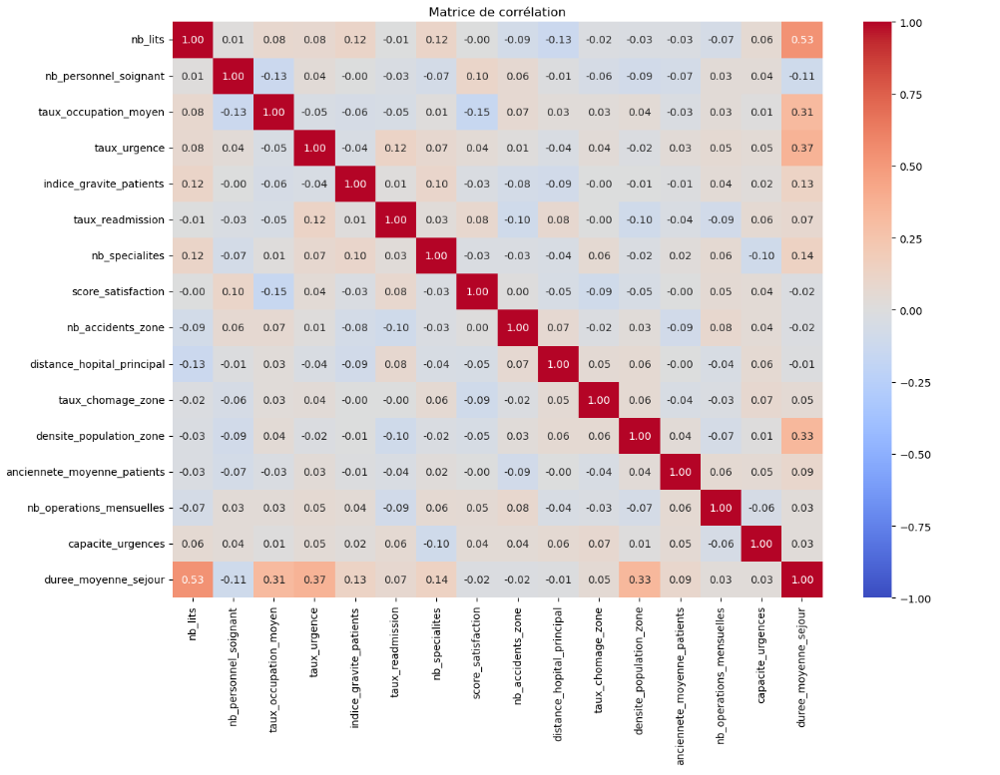
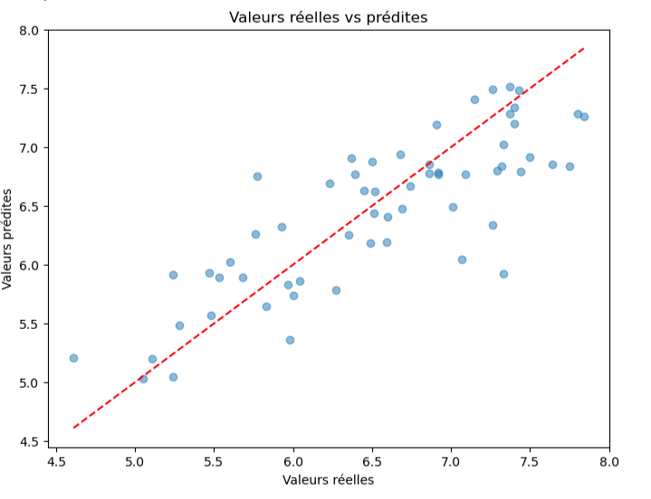

# Machine Learning - Hospital Stay Prediction

## Présentation du projet

Ce projet de Machine Learning a pour objectif de prédire la durée moyenne de séjour dans différents établissements hospitaliers à partir de données décrivant leur activité, leurs capacités et leur environnement.

Le modèle utilisé est une régression linéaire multiple réalisée avec Python et scikit-learn.

## Objectifs

- Explorer et analyser les données hospitalières
- Identifier les relations entre les variables
- Nettoyer et préparer les données
- Construire un modèle de régression linéaire multiple
- Évaluer les performances du modèle
- Prédire la durée moyenne de séjour sur de nouvelles données

## Technologies utilisées

- Python
- pandas
- NumPy
- Matplotlib
- Seaborn
- scikit-learn
- Jupyter Notebook
- Excel

## Méthodologie

Le projet comprend plusieurs étapes :

1. Analyse exploratoire des données
2. Analyse des distributions et des corrélations
3. Traitement des valeurs manquantes
4. Séparation des données en jeux d'entraînement et de test
5. Entraînement d'un modèle de régression linéaire multiple
6. Évaluation avec R², MSE et RMSE
7. Prédiction sur de nouvelles données

### Analyse des corrélations

## Résultats

Le modèle obtient les performances suivantes :

- **R² : 0,6634**
- **MSE : 0,21**
- **RMSE : 0,46 jour**, soit environ 11 heures

Le modèle explique environ 66 % des variations de la durée moyenne de séjour. Les résultats sont corrects mais restent perfectibles.

## Conclusion

Le modèle permet d'obtenir une estimation de la durée moyenne de séjour à partir des caractéristiques des établissements hospitaliers.

Il peut constituer un outil d'aide à l'analyse, mais ne doit pas être utilisé comme seul élément pour une prise de décision stratégique.

## Notebook

Le notebook complet est disponible ici :

[Voir le notebook](NOTEBOOK/hospital_stay_prediction.ipynb)
